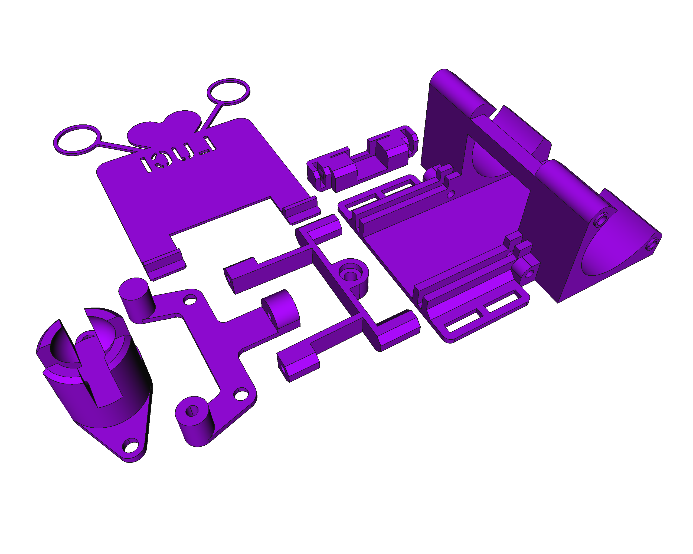
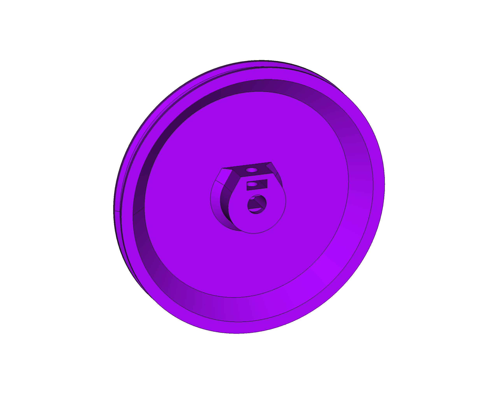
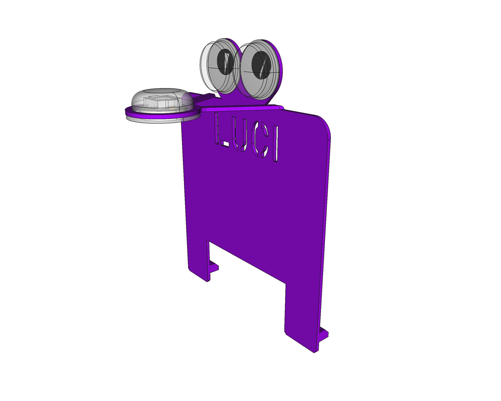

# Escornabot Luci - 3D

Este é o modelo 3D de **Luci**:

Estas son as pezas novas para esta subespecie:

de esquerda a dereita: **porta-bola**, **carauta NeoPixel**, **soporte teclado**, **soporte porta-bola**, **soporte interruptor** e **chasis**.

## Modelos 3D editables

Todos os modelos 3D foron creados coa ferramenta open-source [FreeCAD](https://www.frecad.org), e están dispoñibles para a súa edición:

* [`Escornabot-Luci.FCStd`](Escornabot-Luci.FCStd), modelo principal (o da imaxe) que contén tódalas novas pezas
* [`keypad-cover.FCStd`](keypad-cover.FCStd), a coberta do teclado
* [`wheel-left.FCStd`](wheel-left.FCStd) e [`wheel-right.FCStd`](wheel-right.FCStd), as rodas
* [`wheel-base.FCStd`](wheel-base.FCStd), a roda base, por se queres personalizala
* [`Escornaface-NeoPixel.FCStd`](Escornaface-NeoPixel.FCStd), carauta separada, por se queres personalizala

## Listado STL

Na carpeta [`stl`](stl) poderás atopar todos os ficheiros das 10 pezas, listas para ser impresas con calqueira impresora 3D.

Pezas novas:

* [`Porta-bola`](stl/luci-ballcaster.stl)
* [`Carauta NeoPixel`](stl/luci-escornaface-NP.stl)
* [`Soporte teclado`](stl/luci-keypad-chasis-support.stl)
* [`Soporte porta-bola`](stl/luci-keypad-ballcaster-support.stl)
* [`Soporte interruptor`](stl/luci-switch-holder.stl)
* [`Chasis`](stl/luci-chasis.stl)
* [`Cápsula NeoPixel`](stl/luci-neopixel.stl) (non aparece na imaxe anterior)

Pezas reutilizadas:

* [`Roda esquerda`](stl/wheel-left.stl)
* [`Roda dereita`](stl/wheel-right.stl)
* [`Cubre teclado`](stl/keypad-cover.stl)

## LICENZA

Este traballo está suxeito á licenza [GNU General Public v3.0 License](../LICENSE-GPLV30). Todos os ficheiros multimedia e de datos que non sexan código fonte están suxeitos á licenza [Creative Commons Attribution 4.0 BY-SA license](../LICENSE-CCBYSA40).

Máis información acerca destas licenzas en [licenzas Opensource](https://opensource.org/licenses/) e [licenzas Creative Commons](https://creativecommons.org/licenses/).
