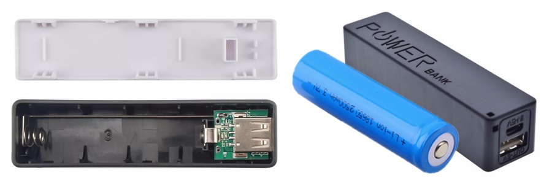
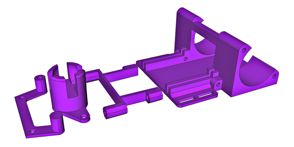
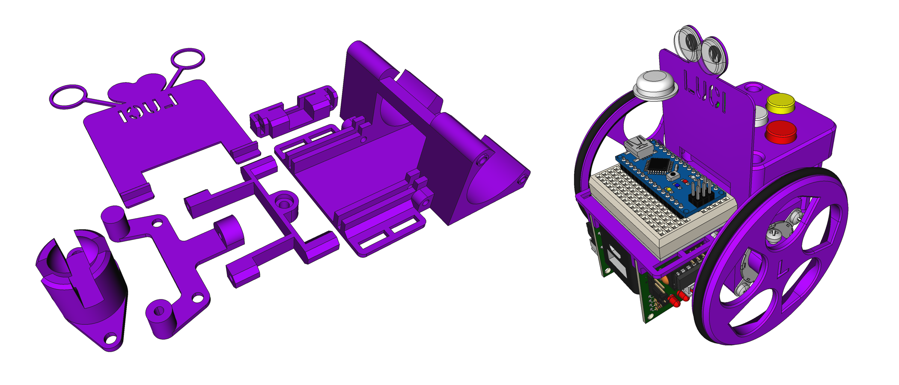
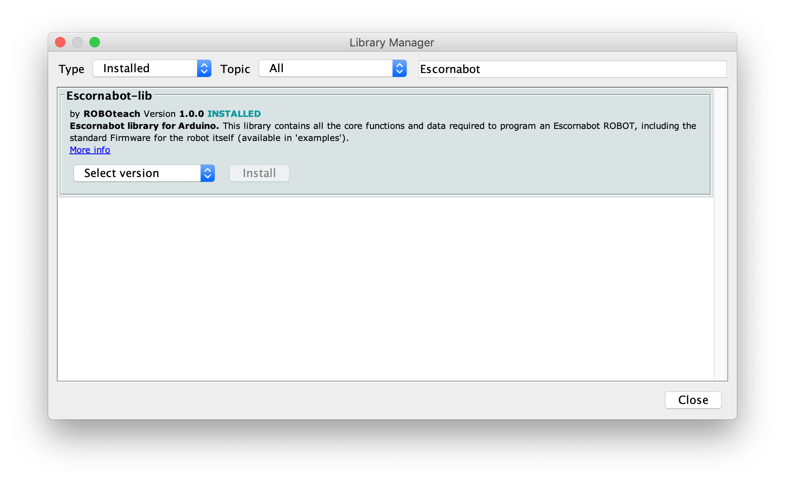

# DESENVOLVENTO de Luci

Algunhas notas sobre o proceso de desenvolvemento de Luci. Non é algo riguroso ou
sistemático, soamente unha especie de *bitácora*.

## Arrinque
O desenvolvemento de **Luci** comezou a finais do 2021: fartas do problema das
pilas decidimos intentar -en serio(™)- facer unha versión baseada nun
[*powerbank-DIY*](POWERBANK.md), reutilizando celas 18650 Li-ion recicladas de
baterías de portátiles vellos ou estropeados.

O obxectivo era facelo **accesible**, simple e o mais seguro posible:

* Compoñentes económicos e fáciles de atopar
* Montaxe simple, apto para calqueira nivel
* Seguro, empregando kits prefabricados con mecanismos de protección
* Principio das múltiples R (Reducir, Reutilizar, Reciclar, Recuperar, Reparar ...)
* Principio de deseño [KISS](https://en.wikipedia.org/wiki/KISS_principle)

Empezamos collendo os compoñentes físicos e posicionandoos, probando distintas
configuracións para tratar de ver que funcionaba e que sensacións tiñamos, discutindo
sobre que podería funcionar ou que problemas poderiamos ter.

## 1 xaneiro 2022
A última acción do 2021 e primeira do 2022 foi publicar o repositorio git do
proxecto en [github](https://github.com/roboteach-es/escornabot-luci): tratábase
dunha proba de concepto onde, nun modelo 3D en [FreeCAD](https://freecad.org),
posicionamos todos os compoñentes de Luci (motores+drivers, mini-breadboard+arduino,
teclado, rodas, bola-tola e powerbank) tal e como decidiramos na discusión previa.

Foi o nacemento **oficial e formal** público do proxecto.

## 8-9 decembro 2022
**Despois de case un ano** sen ningunha actividade, retomouse o deseño 3D en FreeCAD
para tratar de crear un chasis funcional. Partindo do traballo previo, fixéronse
ata tres versións distintas con múltiples iteracións para axustar pequenas cousas,
ata chegar ao primeiro esqueleto que permitía montar todos os compoñentes.

O mais salientable é que a peza do chasis, a pesar desa ponte de 25mm, pódese imprimir 
perfectamente sen soportes (nunha impresora básica calqueira como pode ser a *Ender-3*).

## 10 decembro 2022
Probando o primeiro prototipo apareceron algúns problemas, as veces menores e
outros non tanto:

* **Equilibrio**: Luci balacéase con facilidade, xa que a cela 18650 non pesa
  tanto como as pilas e o centro de gravidade esta moi próximo aos eixos de
  rotación no punto central. Cun pequeno refinamento mellorou, pero seguirá
  sendo a mais equilibrista (o que pode acabar convertíndose no seu selo de
  identidade 😅💃🏽)
* **Cables**: *arboran* con facilidade e os conectores dupont deron moita guerra
   co espacio que ocupan. Cunhas pequenas guías para os cables e algúns axustes de
  posición, acabaron encaixando.
* **Autoapagado**: a maioría dos *powerbank* teñen unha función de autoapagado
  e se desconectan se non detectan suficiente consumo de enerxía. O consumo de
  Luci en reposo non é suficiente para evitalo, e este problema... non é trivial.

### Autoapagado
Cando Luci está en movemento, o consumo (dos motores) é suficiente alto e non hai
problema, pero o tempo de reposo máximo é pequeno (uns poucos segundos) e, ademáis,
o comportamento varía dun powerbank a outro:

* **HT4928S**: estando Luci en reposo e, aproximadamente aos 12 seg., salta o
  autoapagado. Unha vez apagado, actívase o modo de detección de "nova conexión" e,
  como hai algo conectado, volve a acenderse. É dicir, temos un círculo vicioso de
  reinicios cada 12 seg.: non consume o suficiente para manterse acendido pero
  si consume o suficiente para reacenderse. 🤷🏽‍♂️
* **TP4333**: o consumo mínimo é maior, pero cando se apaga, realmente queda
  apagado (non se reinicia).

Ambos comportamentos teñen os seus PROs e CONTRAs, e barállanse varias opcións
para "resolvelo":

* engadir unha carga paralela permanente (LEDs)? (maior consumo, mais complexidade...)
* incluir no *firmware* un sistema *anti-reposo* como, por exemplo, acender bobinas
  periódicamente en caso de inactividade (probablemente a opción menos mala...)
* en último caso... facer un powerbank dende cero? (non cumpre o principio KISS)

En calqueira caso, un firmware novo é unha tarefa longamente requerida (e
postergada)...

## 11-12 decembro 2022
Prototipo inicial rematado, con algunhas modificacións extra e un par de novas
pezas: soporte do interruptor e a carauta.

Agora hai que deixalo *"respirar"* e probar a usalo **no campo** para descubrir
que cousas hai que corrixir ou mellorar. Algún *early-adopter* léndonos?

**PROBLEMAS:** o conector USB queda escondido trala roda (hai que quitala para poder
conectar o cable). 
**PORFACER:** programar un novo firmware con anti-reposo.

## 16-25 decembro 2022
**Luci** non ía ser moi útil sen software, e os problemas, complexidade e
sobre-enxeñería do [firmware *oficial*](https://github.com/escornabot/arduino),
non convidaban a seguir *meténdolle mais horas(™)*, así que creamos unha
[*suite* **completamente nova**](https://github.com/roboteach-es/escornabot-lib),
partindo dende cero e aproveitando a experiencia recollida, primeiro do firmware
anterior (que ten moitas cousas boas) e, sobre todo, da nosa propia labor
\[docente\] de campo, tras empregar o Escornabot en moitos e moi variados
escenarios formativos e didácticos.

Esta nova *suite* está publicada a través da propia **plataforma de Arduino**,
de maneira que aparece como unha bibliteca instalable directa e automaticamente
a través do [seu IDE](https://www.arduino.cc/en/software). Componse de:

* unha **biblioteca base** que recolle todas as funcionalidades fundamentais
* un conxunto de **exemplos** onde se ilustra o seu emprego
* un novo **firmware** que está escrito a partires dela

Deste xeito, ademáis de simplificarse moito, abstráese o núcleo, o que resulta
moi convinte para outras áreas como a integración con ferramentas de terceiros
(por exemplo, a contorna de programación visual *mBlock-3* &rarr; `TODO`).

O novo sistema está deseñado **específicamente para Luci** e, para poder
alcanzar o que nos propusimos inicialmente, hai certos aspectos que son únicos
e \[inicialmente\] incompatibles co anteriormente existente:

* novo [**esquema de conexionado**](Electrónica) optimizado para Luci (alimentación 5V)
* sistema de control de motores optimizado ([empregando
  *PORTx*](https://github.com/mgesteiro/steppers#portx-vs-digitalwrite))
* resolución do [**problema do autoapagado**](#autoapagado) dos *powerBank*
* control de inactividade
* autoconfiguración do teclado
* incorporación dun NeoPixel (LED RGB)
* resolución de problemas de interfaz e UX (botón azul)
* e soporte correcto para RTTTL

Esta suite está xa dispoñible no seu propio 
[repositorio **Escornabot-lib**](https://github.com/roboteach-es/escornabot-lib).

## 30-31 decembro 2022
Último millón de axustes e READMEs y mil pequenas cousas mais para a publicación
final de **Luci**: xusto **un ano despois**.

Queda moito por facer, pero é unha boa base de partida, con moitos **hitos
importantes** alcanzados:

* Prototipo hardware rematado e validado (pódese fabricar!)
* Suite de software completa, con todas as funcionalidades orixinais (pódese programar!)
* Documentación base rematada (está documentado!)