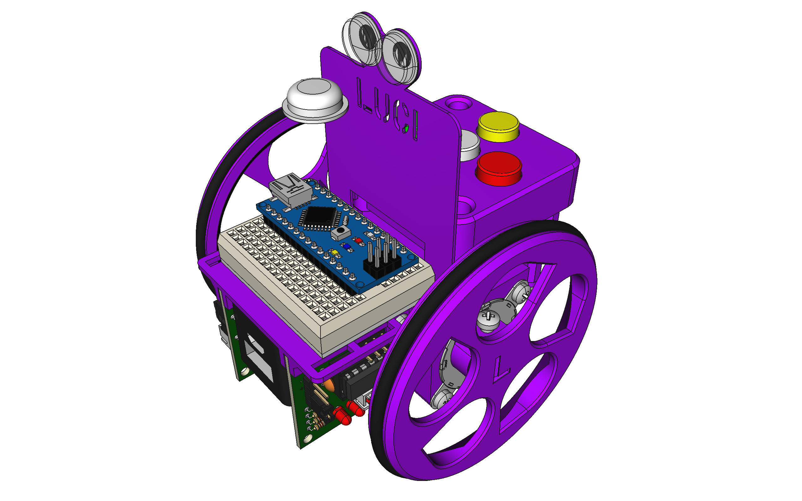
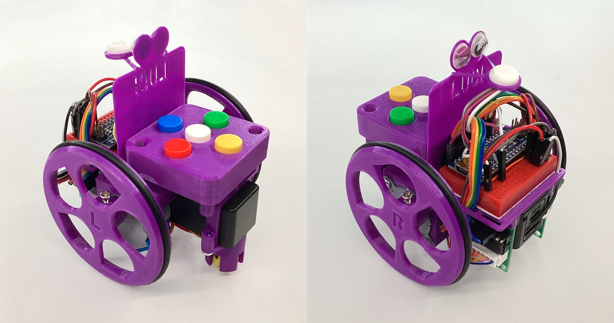
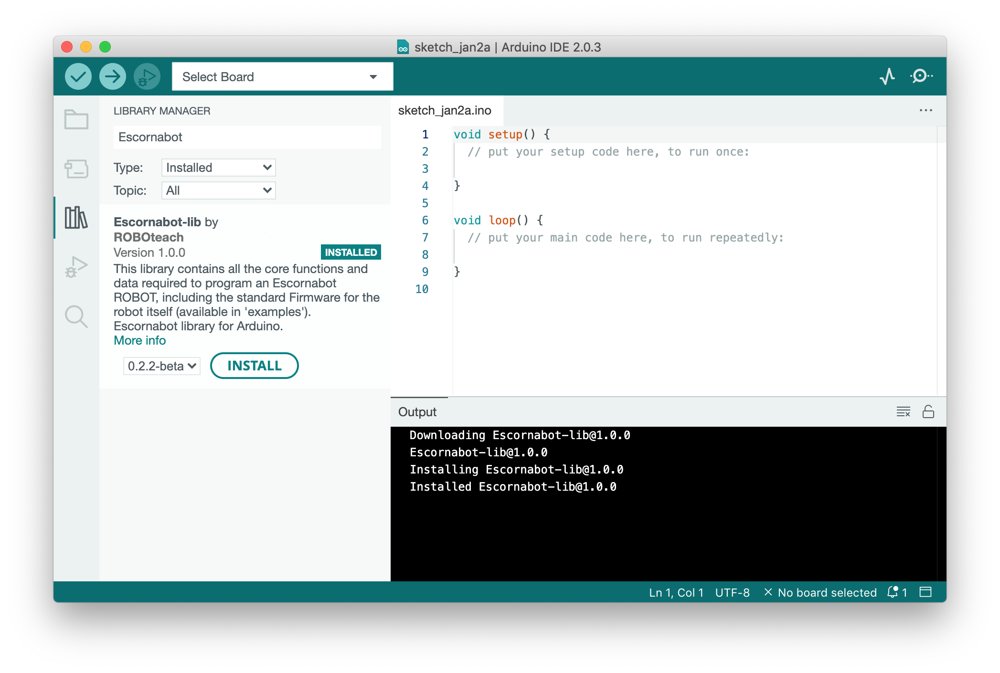

# Escornabot Luci

En base á nosa propia experiencia docente co [**Escornabot Brivoi**](https://www.escornabot.org/wiki/index.php?title=Archivo:Brivoi-001.jpg), xurdiu a necesidade de crear unha nova *subespecie* (ou versión). Baseada no Brivoi, incorporámoslle un sistema de **alimentación recargable** que axuda en varias frontes:

1. Supresión das pilas (aforro económico e ecolóxico)
2. Maior tempo de uso (maior cantidade de enerxía)
3. Facilidade de uso (basta con recargar, sen montar/desmontar para cambiar pilas)
4. Ideal para facer reciclaxe (cargadores de móbil, baterías de portátiles etc.)

Somos conscientes tamén das contraindicacións do emprego de baterías, e tivéronse en conta á hora de deseñar esta subespecie (por exemplo, **a seguridade**). Tamén coidamos todo o posible **o equilibrio** entre a dificultade de fabricación, o coste dos materiais e a usabilidade/practicalidade, xa que un dos obxectivos fundamentais é **a ACCESIBILIDADE** (en sentido amplo!).

Continuando coa tradición do sistema de nomeclatura do proxecto Escornabot, decidimos bautizalo empregando unha das subespecies, escollendo a [subespecie **Luci**](https://species.wikimedia.org/wiki/Lucanus_luci) por tratarse dun nome **feminino** e relativo á **luz**. E a cor identificativa: **violeta** (claramente! 🙆🏽‍♀️😊)

## NOVIDADES

**Luci** trae unhas cantas novidades:

* **Batería recargable**, gracias a un *PowerBank-DIY*
* **LED RGB**, gracias a un *NeoPixel*
* **Chasis 3D**, adaptado ao novo sistema de alimentación
* **Firmware**, para dar soporte ás novas funcións
* **Biblioteca programable**, na que se basea o *Firmware*

Físicamente, **Luci** é moi similar ao **Brivoi** do que parte, con apenas 5 mm de ancho adicionais, conservando o **factor de forma** que todas coñecemos (e tanto nos gusta), polo que podes usalo exactamente **igual que o anterior**. Leva a mesma cantidade de tornillos e segue sendo igual de fácil de montar. O **coste de fabricación** tamén é moi similar, incluso mais económico se consegues facer **reciclaxe de baterías**. A maior vantaxe económica (e ecolóxica) é, sen embargo, o **aforro a longo prazo**, xa que podes recargalo e non terás que mercar (nin tirar) mais pilas.

**Luci** está en continuo desenvolvemento, e ainda é un *traballo en marcha*: se descubres calqueira problema, ou queres facer algunha aportación, por favor **contacta con nos**, estaremos encantadas de saber de ti.

## QUERO UN, como fago?

Se queres un **Escornabot Luci** podes acudir á [**guía de fabricación**](FABRICACIÓN.md) para facerte tantos como queiras: nela explicamos todo o necesario, dende a merca de compoñentes, pasando pola impresión 3D ate a reciclaxe de baterías.

## INFORMACIÓN

O proxecto **Luci** está conformado por diversos apartados que se recollen a continuación:

### HARDWARE

Na carpeta [`3D`](3D) atoparás todos os **modelos 3D** editables das pezas, creadas usando [FreeCAD](https://freecad.org). Tamén están dispoñibles os **ficheiros STL**, listos para ser impresos en 3D.

O compoñente central de Luci é o [PowerBank-DIY](POWERBANK.md), que está documentado no seu propio apartado.

Na carpeta [`Electrónica`](Electrónica) atoparás o esquema de conexionado, creado con [Fritzing](https://fritzing.org).

### SOFTWARE

Na carpeta [`Programación`](Programación) atoparás todo o relativo ao apartado de programación, ainda que a [**biblioteca programable e o Firmware**](https://github.com/roboteach-es/escornabot-lib) teñen o seu propio repositorio específico.

### BITÁCORA

Se queres saber detalles do desenvolvento, levamos unha especie de bitácora que [podes ler](DESENVOLVEMENTO.md).

## LICENZA

Este traballo está suxeito á licenza [GNU General Public v3.0 License](LICENSE-GPLV30). Todos os ficheiros multimedia e de datos que non sexan código fonte están suxeitos á licenza [Creative Commons Attribution 4.0 BY-SA license](LICENSE-CCBYSA40).

Máis información acerca destas licenzas en [licenzas Opensource](https://opensource.org/licenses/) e [licenzas Creative Commons](https://creativecommons.org/licenses/).
